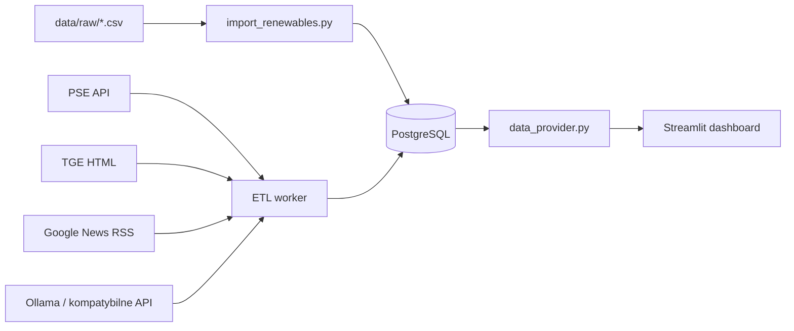

<div align="center">

# Energy Dash

**Techniczny dashboard polskiego rynku energii**

PSE + TGE + RSS/LLM + dane aktywów OZE w jednym panelu Streamlit.

</div>

> Projekt demonstracyjny i rekrutacyjny. Dane oraz wskaźniki prezentowane przez aplikację mają charakter poglądowy i nie powinny być traktowane jako rekomendacja handlowa ani źródło danych referencyjnych.

## Spis treści

- [Co robi projekt](#co-robi-projekt)
- [Architektura](#architektura)
- [Wymagania](#wymagania)
- [Szybki start przez Docker Compose](#szybki-start-przez-docker-compose)
- [Uruchomienie lokalne przez uv](#uruchomienie-lokalne-przez-uv)
- [Zasilenie bazy danymi](#zasilenie-bazy-danymi)
- [Konfiguracja](#konfiguracja)
- [Aplikacja i moduły](#aplikacja-i-moduły)
- [ETL i harmonogram](#etl-i-harmonogram)
- [Model danych](#model-danych)
- [Praca deweloperska](#praca-deweloperska)
- [Troubleshooting](#troubleshooting)
- [Ograniczenia i dalszy rozwój](#ograniczenia-i-dalszy-rozwój)

## Co robi projekt

Energy Dash pobiera, przechowuje i wizualizuje dane związane z polskim rynkiem energii:

- ceny i status kontraktowania z API PSE,
- ceny Fixing I, Fixing II i wolumeny z tabeli RDN TGE,
- artykuły rynkowe z Google News RSS,
- strukturyzowane podsumowania newsów generowane przez model LLM,
- przykładowe dane generacji i prognoz dla farm wiatrowych i fotowoltaicznych.

Demo aplikacji możesz znaleźć na [Energy Dashboard](https://energy.damwid.eu)
Interfejs ma cztery główne obszary analityczne:

| Widok | Zawartość |
| --- | --- |
| **Strona główna** | Bieżące i wczorajsze średnie Fixing I, Fixing II i CEN oraz wykresy 15-minutowe/godzinowe. |
| **Analiza cenowa** | Zakres dat, wybór indeksu, statystyki, profil dobowy, spread, heatmapa i PEAK5/BASE. |
| **Analiza asetów wytwórczych** | Mapa farm, moc zainstalowana, capacity factor, generacja, prognoza i metryki błędu. |
| **Newsy rynkowe** | Digest podzielony na wpływ krótkoterminowy i długoterminowy, z linkami do źródeł. |

## Architektura



Repozytorium nie używa migracji Alembic. Schemat jest tworzony przez SQLAlchemy w czasie startu workera ETL (`Base.metadata.create_all`). Z tego powodu zmiany modeli nie są automatycznie migracjami produkcyjnymi: przy zmianie istniejącej tabeli trzeba przygotować migrację lub ręczną zmianę schematu.

### Usługi Docker Compose

| Usługa | Rola | Port |
| --- | --- | --- |
| `postgres_db` | PostgreSQL 15 i trwały wolumen `postgres_data` | `5458` na hoście w trybie developerskim, `5432` wewnątrz sieci Compose |
| `etl_worker` | Jednorazowe pobranie danych przy starcie i scheduler APScheduler | brak |
| `streamlit_app` | Dashboard Streamlit | `http://localhost:8501` |


## Wymagania

### Wariant Docker, rekomendowany

- Docker Engine z Compose V2 (`docker compose version`),
- dostęp do internetu podczas budowania obrazów i pobierania danych,
- minimum kilka GB wolnego miejsca na obrazy, zależności i wolumen PostgreSQL.

### Wariant lokalny

- Python **3.14** (`.python-version`),
- `uv`,
- lokalny PostgreSQL albo PostgreSQL uruchomiony z Compose,
- opcjonalnie Ollama lub inne API zgodne z interfejsem używanym przez LiteLLM.

## Szybki start przez Docker Compose

### 1. Konfiguracja środowiska

W katalogu głównym repozytorium utwórz `.env`:

```bash
cp .env.example .env
```

Plik `.env` jest ignorowany przez Git. Przed wdrożeniem zmień domyślne hasło PostgreSQL.

### 2. Zbudowanie i uruchomienie usług

```bash
docker compose up --build -d
```

Sprawdź status:

```bash
docker compose ps
docker compose logs -f etl_worker
```

Po uruchomieniu otwórz [http://localhost:8501](http://localhost:8501).

Worker przy starcie:

1. czeka na zdrowy PostgreSQL,
2. tworzy tabele,
3. pobiera CEN z ostatnich 2 dni,
4. pobiera RCE i dane TGE z ostatnich kilku dni,
5. uruchamia scheduler.

Pierwsze zasilenie może potrwać, bo część źródeł jest pobierana przez sieć. Sam Streamlit może wystartować wcześniej, ale do czasu zapisania danych niektóre widoki będą puste.

### 3. Załadowanie przykładowych aktywów OZE

Pliki CSV w `data/raw/` nie są ładowane automatycznie przez główny worker. Uruchom import osobno:

```bash
docker compose exec etl_worker python src/scripts/import_renewables.py
```

Skrypt jest idempotentny: ponowne uruchomienie aktualizuje istniejące rekordy zamiast ich dublować.

### 4. News digest i LLM

W `docker-compose.yml` nie ma usługi Ollama. Digest newsów wymaga działającego endpointu LLM dostępnego z kontenera `etl_worker`. Najprościej użyć Ollama uruchomionego na osobnym hoście/usłudze i ustawić w `.env` właściwy `OLLAMA_API_BASE` oraz `LLM_MODEL`.

Jeśli chcesz uruchomić system bez generowania digestu, pobierz same artykuły:

```bash
docker compose exec etl_worker python src/scripts/seed_news.py --skip-digest
```

## Uruchomienie lokalne przez `uv`

Ten wariant wykorzystuje PostgreSQL z Compose, ale uruchamia ETL i Streamlit bezpośrednio na hoście.

### 1. Zainstaluj zależności

```bash
uv sync
source .venv/bin/activate
```

Na Windows użyj `.venv\\Scripts\\activate`. `uv.lock` zapewnia powtarzalne wersje zależności; do instalacji dokładnie z lockfile można użyć `uv sync --frozen`.

### 2. Uruchom samą bazę

```bash
cp .env.example .env
docker compose up -d postgres_db
```

Przy uruchomieniu poza Dockerem `POSTGRES_HOST` powinien być ustawiony na `localhost`, a `POSTGRES_PORT` na `5458`:

```dotenv
POSTGRES_HOST=localhost
POSTGRES_PORT=5458
```

### 3. Uruchom aplikację

W pierwszym terminalu:

```bash
uv run streamlit run src/app/main.py
```

Dashboard będzie dostępny pod [http://localhost:8501](http://localhost:8501).

### 4. Uruchom workera ETL

W drugim terminalu:

```bash
uv run python src/run_etl.py
```

Proces jest długotrwały i utrzymuje scheduler. Zatrzymasz go przez `Ctrl+C`.

## Zasilenie bazy danymi

Wszystkie skrypty uruchamiaj z katalogu głównego projektu. Przed seedowaniem PostgreSQL musi działać, a zmienne w `.env` muszą wskazywać właściwy host i port.

### Dane PSE

```bash
# RCE, domyślnie ostatnie 60 dni
uv run python src/scripts/seed_pse.py

# CEN, domyślnie ostatnie 60 dni
uv run python src/scripts/seed_pse.py --from 2026-09-01 --to 2026-09-27
```

Uwaga: `seed_pse.py` uruchamia funkcję CEN (`seed_cen`) w bloku `__main__`. Do jednorazowego seedowania RCE można wywołać funkcję modułowo:

```bash
uv run python -c "from src.scripts.seed_pse import seed_rce; seed_rce()"
```

Daty są datami dostawy i mają format `YYYY-MM-DD`.

### Dane TGE

```bash
uv run python src/scripts/seed_tge.py
uv run python src/scripts/seed_tge.py --from 2026-09-01 --to 2026-09-27
```

TGE udostępnia na stronie około 60 dni historii. Skrypt przycina zbyt stary zakres i wykonuje upsert danych 15-minutowych. Jeśli strona TGE zmieni strukturę HTML, parser celowo zakończy się błędem zamiast zapisać niepewne dane.

### Dane aktywów OZE

```bash
uv run python src/scripts/import_renewables.py
```

Importer oczekuje dokładnie tych kolumn w każdym CSV:

```text
datetime,generation [MWh],generation_forecast [MWh]
```

Znaczniki czasu w CSV są lokalne dla `Europe/Warsaw`, a do bazy trafiają jako UTC. Rekordy z nieistniejącej godziny podczas zmiany czasu są pomijane. Metadane sześciu przykładowych farm są zdefiniowane w `import_renewables.py`.

### Newsy i digest

```bash
# Artykuły bez wywołania LLM
uv run python src/scripts/seed_news.py --skip-digest

# Artykuły oraz digest z domyślnych 2 dni
uv run python src/scripts/seed_news.py

# Sam digest na podstawie artykułów już zapisanych w bazie
uv run python src/scripts/seed_news.py --digest-only

# Wymuszenie nadpisania digestu dla bieżącej doby UTC
uv run python src/scripts/seed_news.py --force

# Inne okno pobierania RSS
uv run python src/scripts/seed_news.py --days-back 7
```

Digest powstaje w dwóch krokach: LLM wybiera istotne artykuły z nagłówków, a następnie generuje punkty z pełnych treści lub samych nagłówków. Odpowiedź jest walidowana przez modele Pydantic.

## Konfiguracja

Minimalny `.env`:

```dotenv
POSTGRES_USER=energy_user
POSTGRES_PASSWORD=zmien_to_haslo
POSTGRES_DB=energy_db
POSTGRES_HOST=postgres_db
POSTGRES_PORT=5432

OLLAMA_API_BASE=http://ollama:11434
LLM_MODEL=ollama_chat/gpt-oss:20b-cloud
LLM_USE_RESPONSE_FORMAT=1

NEWS_TITLES_LIMIT=100
NEWS_SELECT_MAX=15
NEWS_BODY_MAX_CHARS=4000
```

| Zmienna | Znaczenie | Wartość domyślna w kodzie |
| --- | --- | --- |
| `POSTGRES_USER` | Użytkownik bazy | `energy_user` |
| `POSTGRES_PASSWORD` | Hasło bazy | `super_secret_password_123` |
| `POSTGRES_DB` | Nazwa bazy | `energy_db` |
| `POSTGRES_HOST` | Host PostgreSQL | `localhost` |
| `POSTGRES_PORT` | Port PostgreSQL | `5458` |
| `OLLAMA_API_BASE` | Endpoint API dla LiteLLM | `http://localhost:11434` |
| `LLM_MODEL` | Identyfikator modelu LiteLLM/Ollama | `ollama_chat/gpt-oss:20b-cloud` |
| `LLM_USE_RESPONSE_FORMAT` | Wysyłanie schematu odpowiedzi do providera (`1`/`0`) | `1` |
| `NEWS_TITLES_LIMIT` | Maksymalna liczba nagłówków wejściowych | `100` |
| `NEWS_SELECT_MAX` | Maksymalna liczba wybranych artykułów | `15` |
| `NEWS_BODY_MAX_CHARS` | Limit znaków treści pojedynczego artykułu | `4000` |

Ważne: Compose nadpisuje `POSTGRES_HOST=postgres_db` i `POSTGRES_PORT=5432` dla `etl_worker` i `streamlit_app`. Nie zmieniaj tych wartości na `localhost` wewnątrz kontenera, bo wtedy kontener będzie szukał bazy w sobie.

## Aplikacja i moduły

```text
src/
├── run_etl.py                  # worker i scheduler APScheduler
├── app/
│   ├── main.py                 # nawigacja Streamlit
│   ├── layout.py               # wspólny layout i style
│   ├── data_provider.py        # zapytania SQL, cache i normalizacja danych
│   ├── components/charts.py    # wykresy Plotly
│   └── pages/                  # ekrany dashboardu
├── common/
│   ├── config.py               # .env i DATABASE_URL
│   ├── database.py             # silnik SQLAlchemy i sesje
│   └── llm.py                  # LiteLLM + walidacja odpowiedzi Pydantic
├── etl/
│   ├── extract/pse_api.py      # CEN/RCE z PSE
│   ├── extract/tge_api.py      # parser RDN TGE
│   ├── extract/news_rss.py     # Google News RSS
│   └── transform/news_digest.py# pobieranie treści i digest
├── models_db/                  # modele SQLAlchemy
├── schemas/news.py             # kontrakt JSON digestu
└── scripts/                    # ręczne importy i seedy
```

Warstwy są celowo rozdzielone. Nowe dane dodawaj w kolejności: model bazy, ekstraktor ETL, funkcja w `data_provider.py`, a dopiero potem widok Streamlit.

## ETL i harmonogram

Worker wykonuje zadania od razu po starcie, a następnie pracuje w strefie `Europe/Warsaw`:

| Zadanie | Harmonogram | Zakres |
| --- | --- | --- |
| CEN w szczycie | co 30 minut, 07:00–18:00 | ostatnie 2 dni |
| CEN poza szczytem | co godzinę, pozostałe godziny | ostatnie 2 dni |
| RCE + TGE | codziennie o 14:00 | RCE: 5 dni, TGE: 3 dni |
| News digest | co godzinę 07:00–11:00, tylko gdy brak digestu | RSS z ostatnich 2 dni |

Po uruchomieniu po 07:00 worker próbuje nadrobić digest bieżącej doby. Blokada wątkowa zapobiega równoległemu generowaniu newsów. Operacje zapisu danych rynkowych i newsów są projektowane jako upsert/deduplicate, dlatego restart workera nie powinien tworzyć duplikatów.

W bazie wszystkie znaczniki czasu są przechowywane w UTC. UI konwertuje je do `Europe/Warsaw`; zakresy dat wybierane w Streamlit również są tłumaczone na UTC przed zapytaniem.

## Model danych

| Tabela | Zawartość | Klucz / deduplikacja |
| --- | --- | --- |
| `energy_prices` | RCE, CEN, Fixing I/II, wolumeny i status KSE w interwałach 15-minutowych | `datetime_utc` |
| `renewable_farms` | Metadane farm, technologia, moc, region i współrzędne | `id`, unikalny `code` |
| `renewable_generation` | Generacja rzeczywista i prognozowana farm | `(farm_id, datetime_utc)` |
| `news_articles` | Artykuły RSS, źródło, temat, link i pobrana treść | unikalny `url` |
| `news_digests` | Walidowany JSON z podsumowaniem i źródłami | unikalny `issued_day_utc` |

Nie ma osobnego systemu migracji ani panelu administracyjnego. Kopia danych PostgreSQL jest przechowywana w wolumenie Docker `postgres_data`.

## Praca deweloperska

### Kontrola jakości

```bash
uv run ruff check src
uv run ruff format --check src
```

Automatyczne testy nie są obecnie zdefiniowane w projekcie. Najtańsza weryfikacja zmiany ETL to uruchomienie odpowiedniego seedera na małym zakresie dat, sprawdzenie logów i ponowne uruchomienie w celu potwierdzenia idempotencji.

### Przydatne komendy Docker

```bash
docker compose ps
docker compose logs -f streamlit_app
docker compose logs -f etl_worker
docker compose restart streamlit_app
docker compose exec postgres_db psql -U energy_user -d energy_db
docker compose down
```

`docker compose down` usuwa kontenery i sieć, ale pozostawia wolumen bazy. Aby usunąć również dane lokalnej bazy:

```bash
docker compose down -v
```

To jest operacja destrukcyjna dla `postgres_data`.

### Workflow zmiany funkcjonalnej

1. Zmień model w `src/models_db/`, jeżeli potrzebujesz nowej struktury danych.
2. Dodaj lub zmień ekstraktor w `src/etl/extract/` i uruchom go ręcznie na małym zakresie.
3. Dodaj zapytanie i transformacje w `src/app/data_provider.py`.
4. Podepnij gotowy DataFrame do strony w `src/app/pages/`.
5. Uruchom Ruff oraz ręczną weryfikację przez Docker Compose.
6. Zatrzymaj logi i sprawdź, czy restart oraz ponowne seedowanie nie dublują rekordów.

## Troubleshooting

### `connection refused` do PostgreSQL

- Host uruchamiany lokalnie: użyj `POSTGRES_HOST=localhost`, `POSTGRES_PORT=5458`.
- Kod uruchamiany w kontenerze: użyj `POSTGRES_HOST=postgres_db`, `POSTGRES_PORT=5432`.
- Sprawdź `docker compose ps` i `docker compose logs postgres_db`.

### Dashboard działa, ale wykresy są puste

Sam start Streamlita nie oznacza, że baza ma dane. Sprawdź logi ETL, uruchom odpowiedni seeder i odśwież stronę. Cache zapytań w `data_provider.py` ma TTL 15 minut dla części funkcji; po seedowaniu pomocny jest restart aplikacji.

### Newsy są, ale nie ma digestu

Najczęstsze przyczyny to brak endpointu LLM, zły `LLM_MODEL`, brak artykułów w oknie dwóch dni albo odpowiedź modelu niezgodna ze schematem Pydantic. Uruchom:

```bash
docker compose logs -f etl_worker
uv run python src/scripts/seed_news.py --digest-only
```

Jeśli potrzebujesz samego widoku artykułów, użyj `--skip-digest` przy seedowaniu. Ollama nie jest dostarczana przez ten Compose.

### TGE zgłasza zmianę układu tabeli

Parser w `src/etl/extract/tge_api.py` sprawdza nagłówki, liczbę kwadransów i datę dostawy. Najpierw zarchiwizuj odpowiedź HTML i porównaj strukturę strony, dopiero potem aktualizuj parser. Nie wyłączaj walidacji bez sprawdzenia mapowania kolumn.

### Baza wymaga wyzerowania

```bash
docker compose down -v
docker compose up --build -d
```

Następnie ponownie załaduj dane OZE i ewentualnie uruchom seedery PSE/TGE/news. `down -v` usuwa wszystkie dane z lokalnego wolumenu.

## Ograniczenia i dalszy rozwój

- dane OZE w `data/raw/` są przykładowe, a nie feedem produkcyjnym,
- TGE udostępnia ograniczone okno historii i jest parsowane z HTML,
- nie ma migracji schematu, testów automatycznych ani obserwowalności produkcyjnej,
- digest zależy od zewnętrznego providera LLM i dostępności treści artykułów,
- domyślne dane uwierzytelniające służą wyłącznie lokalnemu developmentowi,
- przed wdrożeniem produkcyjnym należy dodać sekrety poza `.env` w repozytorium, backup PostgreSQL, migracje, retry/alerting i testy kontraktowe źródeł.

Naturalne kolejne kroki to dodanie Alembica, testów parserów PSE/TGE, CI z Ruff, monitoringu świeżości danych oraz osobnego serwisu Ollama/LLM w środowisku developerskim.

## Licencja i źródła danych

## Licencja i dane zewnętrzne

Kod źródłowy projektu jest udostępniony na licencji [MIT](LICENSE).

Licencja MIT dotyczy wyłącznie kodu stworzonego w ramach tego projektu. Nie obejmuje:

- danych pobieranych z PSE,
- danych pobieranych z TGE,
- artykułów, treści i materiałów dostępnych przez Google News,
- modeli LLM ani usług zewnętrznych,
- zależności instalowanych z PyPI,
- znaków towarowych i materiałów należących do operatorów źródeł danych.

Aplikacja pobiera część danych z zewnętrznych serwisów podczas działania. Użytkownik uruchamiający aplikację odpowiada za przestrzeganie aktualnych regulaminów, zasad dostępu, limitów zapytań i warunków ponownego wykorzystania danych obowiązujących u dostawców.

Repozytorium nie zawiera dumpu PostgreSQL ani surowej historii danych TGE/PSE. Dane zapisane lokalnie są wynikiem działania ekstraktorów i powinny być traktowane jako dane pozyskane ze źródeł zewnętrznych, a nie jako część kodu objęta licencją MIT.

Źródła danych:

- [PSE](https://www.pse.pl/)
- [Raporty PSE](https://raporty.pse.pl/)
- [TGE](https://tge.pl/)
- [Google News](https://news.google.com/)

Przed użyciem komercyjnym lub publiczną redystrybucją danych należy zweryfikować warunki licencyjne każdego źródła albo uzyskać odpowiednią zgodę jego właściciela.
